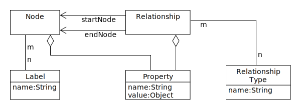
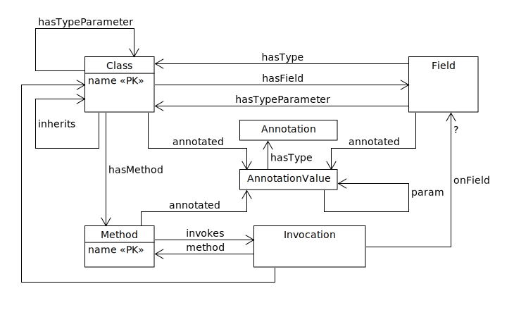
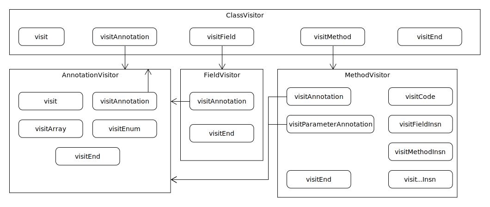

= Get to know your application with graph database
Patrik Duditš, @pdudits
:idprefix:
:revealjs_customtheme: theme/white.css
:revealjs_history: true
:revealjs_transition: fade
:source-highlighter: highlightjs
:highlightjs-theme: theme/source/zenburn.css

== How large is your application?

[.fragment]
Java EE application with over 3000 classes

== Answer this

Which message driven beans depend on singletons?

[.fragment]
That contain a map?

== {sp}

[source,java]
----
@MessageDriven(activationConfig = {
  @ActivationConfigProperty(propertyName="destinationType"
                            propertyValue="javax.jms.Topic"),
  @ActivationConfigProperty(propertyName="destinationName"
                            propertyValue="c.broadcast") } )
public class Processor {
  @EJB
  FooService service;

  public void onMessage(Message m) {  }
}

@Singleton
public class FooService {
  Map<Input, CachedValue> cache;
}
----

== How would you do that in your IDE?

[.fragment]
* Go to definition
* Go to implementation
* Find usages

== structgraph
Your application's structure in graph database

== Ingredients

[%step]
* Cypher: neo4j's powerful graph query and modification language
* Bytecode: buildtool- and framework- independent application structure

== Function

source:: Walk over jar (ear, war) files and look for class files
collect:: Read the class file, extract the information
sink:: Store the information into neo4j

== What is extracted
Types::
 * Inheritance, Annotations
Fields::
 * Types, Annotations, Type Parameters
Methods::
 * Annotations, Invocations of other methods
 * Fields method is invoked upon

== Neo4j data model

== Core structgraph schema

== Simple queries

All methods called save
[source,cypher]
----
MATCH (c:Class)-[:hasMethod]->(m:Method)
WHERE m.methodName = 'save'
RETURN c,m
----

Syntax in detail in
http://neo4j.com/docs/stable/cypher-refcard/[Cypher RefCard]
and
http://neo4j.com/docs/stable/cypher-query-lang.html[Cypher Reference]

== Simple queries

All message driven beans
[source, cypher]
----
MATCH (c:Class)-[aRel:annotated]->(aValue:AnnotationValue)
      -[:hasType]->
      (aType:Annotation{name:'javax.ejb.MessageDriven'})
RETURN c,aValue,aType
----

== Annotation matching shortcuts

During usage several shortcuts were added to better match annotations:

[source,cypher]
----
(c)-[aRel]->(aValue:AnnotationValue)-[:hasType]->(aType{name:'...'})
----

[%step]
. aValue.name = aType.simpleName
. aRel.with = aType.name, aRel.w = aType.simpleName
. c has label aType.simpleName

== Shortcuts examples
[source, cypher]
----
match (c:Class)-[:annotated{w:'MessageDriven'}]->(aValue)
return c,aValue
----

[source, cypher]
----
match (c:MessageDriven) return c
----

== Which message driven beans depend on singletons?
[source,cypher]
----
match (mdb:MessageDriven)-[:hasField]->(sgRef:EJB)-[:hasType]->(t),
      t<-[:inherits*0..]-(sg:Singleton)
return mdb,sgRef,t,sg
----

== ... that have a map?

[source,cypher]
----
match (mdb:MessageDriven)-[:hasField]->(sgRef:EJB)-[:hasType]->(t),
      t<-[:inherits*0..]-(sg:Singleton)-[:hasField]->(f),
      f-[:hasType]-(m{name:'java.util.Map'})
return mdb,sgRef,t,sg
----

== Subtle bug there
We do not index JDK classes, so this won't catch e.g. ConcurrentMap

== Pragmatic solution
[source,cypher]
----
match (mdb:MessageDriven)-[:hasField]->(sgRef:EJB)-[:hasType]->(t),
      t<-[:inherits*0..]-(sg:Singleton)-[:hasField]->(f),
      f-[:hasType]-(m)
where m.name =~ '.+Map' // regular expression matching
return mdb,sgRef,t,sg
----

== Call graph

Where are transaction created in this business method?
[source, cypher]
----
match p=(m:Method{simpleName:"CPBIProcessingScheduler#process()V"})
        -[:invokes|overriden*..14]->(m2)<-[:hasMethod]-(c:Class)
where (m2:TransactionAttribute and
       m2.TransactionAttribute="REQUIRES_NEW") or
      (c:TransactionAttribute and
       c.TransactionAttribute="REQUIRES_NEW")
optional match m2-[:annotated{w:"TransactionAttribute"}]->(a1)
optional match c-[:annotated{w:"TransactionAttribute"}]->(a2)
return p,a1,a2
----

== Aggregations

Most wanted EJBs

[source, cypher]
----
match (c:Class)-[a:annotated]->(), c-[:inherits*0..1]->(interface),
      interface<-[:hasType]-(f:Field)
where a.name =~ "javax\\.ejb.+" and not interface.name =~ "java.+"
  and not ()-[:inherits]->c
return c.name, interface.name, count(f) as usage
order by usage desc
----

== Grammar recap

[source,cypher]
----
MATCH (variable:Label)-[v2:RelationType]->(target),
      (target)-[:type1|type2*0..n]->(trans-closure{prop: value})
OPTIONAL MATCH (variable)-->(like-outer-join)
WHERE v2.prop =~ "regexp"
RETURN v2.prop2
----

== Implementation of structgraph

== Function

source:: Walk over jar (ear, war) files and look for class files
collect:: Read the class file, extract the information
sink:: Store the information into neo4j

== Options for reading class data

java.lang.reflect: Java reflection:: Runtime - needs linking
javax.lang.model: Annotation processing:: Compile - needs all dependencies
javadoc:: Annotation processor's older brother

[.fragment]
No method callgraphs!

== Options for reading class data

Java parser: Eclipse JDT:: Needs to cope with project structure
Java bytecode: ASM:: Unified structure, includes generated artifacts

== ASM: Visitors all way down

== Neo4j Embedded API

[source,java]
----
GraphDatabaseService db = new GraphDatabaseFactory()
    .newEmbeddedDatabase(path);
Runtime.getRuntime().addShutdownHook(new Thread(db::shutdown));
try (Transaction tx = db.beginTx()) {
  Label lbl = () -> "Class";
  Node node = db.createNode(lbl);
  tx.success();
}
----

== Finding

[source,java]
----
try (Transaction tx = db.beginTx()) {
  // single result by label, property, value
  Node result = db.findNode(label, propertyName, propertyValue);
  // multiple results
  try (ResourceIterator<Node> nodes =
       db.findNodes(type, name, value)) {
    while (nodes.hasNext()) {
      Node n = nodes.next();
    }
  }
}
----

== Cypher queries
[source,java]
----
try (Transaction tx = db.beginTx();
     Result result = db.execute(
      "match (n {name: 'my node'}) return n, n.name")) {
  while (result.hasNext()) {
    Map<String,Object> row = result.next();
    for (Entry<String,Object> column : row.entrySet()) {
      println(column.getKey() + ": " + column.getValue() + "; ");
    }
  }
}
----

== Modifying data with Neo4j
[source,cypher]
----
match (a)-[:invokes|overriden]->(b)
create b-[:invokedBy]->a
// Created 106590 relationships in 24676 ms.
----

== Find overriding methods
[source,cypher]
----
match (m:Method)<-[:hasMethod]-(i:Class)-[:inherits*..4]->(c:Class),
      c-[:hasMethod]->(d:Method)
where d.methodName = m.methodName AND d.signature = m.signature
create d-[:overriden]->m
----

== Count overrides
[source,cypher]
----
match (d:Method)-[r:overriden]->()
 with d, count(r) as c
match d-[r:overriden]->()
  set r.p = 1.0/c
----

== Method invocations
[source,java]
----
public class BaseClass {
    protected void methodInParent() {
    }
}

public class DerivedClass extends BaseClass {
    public void method() {
        methodInParent(); // [1]
    }
}
----
[1] What does the bytecode say?

== Virtual method invocation in bytecode
----
$ javap -c DerivedClass.class
Compiled from "DerivedClass.java"
public class DerivedClass extendsBaseClass {
  public DerivedClass();
    Code:
       0: aload_0
       1: invokespecial #1 // Method BaseClass."<init>":()V
       4: return
  public void method();
    Code:
       0: aload_0
       1: invokevirtual #2 // Method methodInParent:()V
       4: return
}
----

== Virtual calls query
[source,cypher]
----
match (m:Method) where not m<-[:hasMethod]-()
----
We had methods without being declared in class

== Virtual calls query

[source, cypher]
----
match (m:Method) where not m<-[:hasMethod]-()
// method.name is Class#name(signature)
 with m, split(m.name,'#')[0] as className
// find a method with same name and signature
match (superMethod:Method{methodName:m.methodName,
       signature:m.signature}),
// which is declared in a superclass
    p=(c:Class{name:className})-[:inherits*]->(super)
      -[:hasMethod]->superMethod //...
----

== Virtual calls query

[source,cypher]
----
with m, collect(p) as allPossibleSuperMethods
// and now keep the closest method (with the shortest path to it)
with m, reduce(path = null, p in allPossibleSuperMethods |
     case
// the candidate is either better than nothing or shorter than
// previous
       when path is null or length(p) < length(path) then p
       else path // or we've got our winner already
     end) as superMethodPath
// and the last on the path is the closest declared method
with m,last(superMethodPath) as superMethod
// so we mark the replacement
create m-[:replaceBy]->superMethod
----

== Structgraph status

* To be open sourced soon
* Plan to support own practical needs, and accept contributions

== Future directions

* Modules
* Method parameter annotations
* CDI, JSF
* Other storage
* Mark loop nesting for invocations
* ...

== You're welcome to help
