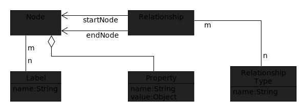

= Get to know your application with graph database
Patrik Duditš, @pdudits
:idprefix:
:revealjs_customtheme: theme/white.css
:revealjs_history: true
:revealjs_transition: fade
:source-highlighter: highlightjs

== How large is your application?

[.fragment]
Java EE application with over 5000 classes

== Answer this

Which message driven beans depend on singletons?

[.fragment]
That contain a map?

== {sp}

[source,java]
----
@MessageDriven
public class Processor {
  @EJB
  FooService service;

  public void onMessage(Message m) {

  }
}

@Singleton
public class FooService {
  Map<Input, CachedValue> cache;
}
----

== How would you do that in your IDE?

[.fragment]
* Go to definition
* Go to implementation
* Find usages

== structgraph
Your application's structure in graph database

== Ingredients

[%step]
* Cypher: neo4j's powerful graph query and modification language
* Bytecode: only open API to your application structure

== Function

source:: Walk over jar (ear, war) files and look for class files
collect:: Read the class file with ASM, extract the information
sink:: Store the information into neo4j

== What is extracted
Types::
 * Inheritance, Annotations
Fields::
 * Types, Annotations, Type Parameters
Methods::
 * Annotations, Invocations of other methods
 * Fields method is invoked upon

== Neo4j data model

== Graph scheme

image::structgraph-basic-model.svg[]

== Simple queries

All methods called save
[source,cypher]
----
MATCH (c:Class)-[:hasMethod]->(m:Method)
WHERE m.methodName = 'save'
RETURN c,m
----

Syntax in detail in
http://neo4j.com/docs/stable/cypher-refcard/[Cypher RefCard]
and
http://neo4j.com/docs/stable/cypher-query-lang.html[Cypher Reference]

== Options for reading class data

java.lang.reflect: Java reflection:: Runtime - needs linking
javax.lang.model: Annotation processing:: Compile - needs all dependencies

[.fragment]
No method callgraphs!

== Options for reading class data

Java parser: Eclipse JDT:: Needs to cope with project structure
Java bytecode: ASM:: Unified structure, includes generated artifacts

== ClassVisitor, FieldVisitor

== AnnotationVisitor

== Nested annotations

== Annotation based queries

Destinations of message driven beans

Entity Graph

== Modifying data with Neo4j

linkImplementations

== Method invocations

Invocations in JVM
AnalyzerVisitor, finding fields

== Virtual calls

== Virtual calls query

== Structgraph status

== Future directions

== You're welcome to help
